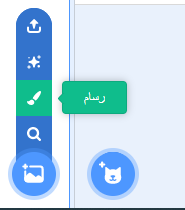
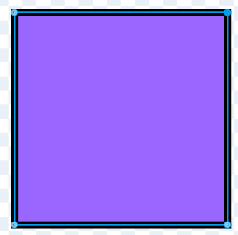
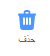
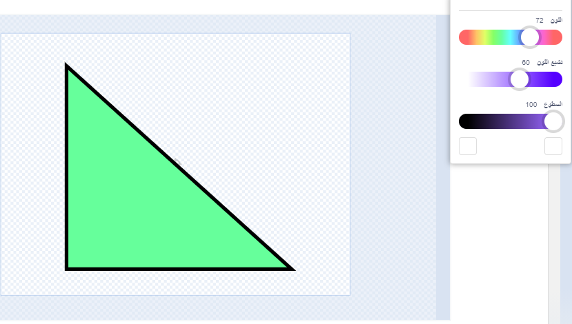
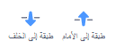
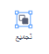

يمكنك إنشاء الخلفيات والأزياء للكائنات في محرر الرسام ، باستخدام الأشكال فقط.

اذهب إلى **اختر كائن** أو **اختر قائمة** واختر خيار **رسم**

 

حدد الأداة (الأدوات) التي ستستخدمها للشكل (الأشكال) الذي تريده.

+ **دائرة**: اضغط على **دائرة** أداة لرسم دائرة. اضغط مع الاستمرار على مفتاح <kbd>shift</kbd> على لوحة المفاتيح لرسم دائرة مثالية.

+ **مستطيل**: اضغط على **مستطيل** أداة لرسم مستطيل. اضغط باستمرار على <kbd>Shift</kbd> لرسم مربع.

+ **مثلث**: حدد **مستطيل** وارسم مستطيلاً أو مربعًا. انقر فوق **اعادة تشكيل** وحدد الزاوية التي تريد إزالتها. انقر فوق **حذف** لتحويل الشكل الخاص بك إلى مثلث.

   

يمكنك استخدام **ملء** لتغيير لون الشكل.

 

قد تحتاج إلى استخدام أدوات **طبقة الى الامام** و **طبقة الى الخلف** لتحريك الأشكال للأمام أو للخلف بحيث يتم وضعها بشكل صحيح داخل صورتك.

يمكنك تحديد كل الأشكال و **المجموعة** معًا بحيث يمكنك تعديلها أو نقلها كشكل واحد.

 

فيما يلي مثال على كائن تم إنشاؤه باستخدام أدوات **الدائرة** و **المستطيل**:

**خنزير**: [انظر في الداخل](https://scratch.mit.edu/projects/495903163/editor){:target="_blank"}

  <iframe allowtransparency="true" width="485" height="402" src="https://scratch.mit.edu/projects/embed/495903163/?autostart=false" frameborder="0"></iframe>

تذكر تسمية الأزياء والخلفيات التي تنشئها في محرر الرسام.
