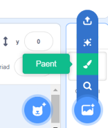

Galli di greu ceflenni a gwisgoedd ar gyfer corluniau yn y golygydd Paent, gan ddefnyddio siapiau yn unig.

Cer i'r ddewislen **Dewiswch Gorlun** neu **Dewiswch Gefnlen** a dewis yr opsiwn **Paent**:

{:style="float: left"}

{:style="float: left"}

Dewisa'r offeryn i'w defnyddio i wneud y siâp rwyt ti ei eisiau:

+ **Cylch**: Clicia ar yr offeryn **Cylch** i dynnu cylch. Pwysa a dal y fysell <kbd>Shift</kbd> ar dy fysellfwrdd i dynnu cylch perffaith.

+ **petryal**: Clicia ar yr offeryn **Petryal** i dynnu petryal. Pwysa a dal y fysell <kbd>Shift</kbd> i dynnu sgwâr.

+ **Triongl**: Defnyddia'r offeryn **Petryal** i dynnu petryal neu sgwâr. Clicia ar yr offeryn **Ail-lunio** a dewi y gornel rwyt ti am ei thynnu. Clicia ar yr offeryn **Dileu** i droi dy siâp yn driongl.

{:style="width: 150px"}

{:style="width: 150px"}

Galli di ddefnyddio'r offeryn **Llenwi** i newid lliw siâp:

{:style="width: 350px"}

Efallai y bydd angen i ti ddefnyddio'r offer **Ymlaen** a **Yn ôl** i symud dy siapiau ymlaen neu yn ôl fel eu bod wedi'u gosod yn gywir yn dy ddelwedd:

Galli di ddewis yr holl siapiau a'u **Grwpio** gyda'i gilydd fel y galli di eu haddasu neu eu symud fel un siâp:

{:style="width: 350px"}

Dyma enghraifft o corlun a grëwyd gyda'r offer **Cylch** a **Petryal**:

**Mochyn**: [Gweld tu mewn](https://scratch.mit.edu/projects/495903163/editor){:target="_blank"}

  <iframe allowtransparency="true" width="485" height="402" src="https://scratch.mit.edu/projects/embed/495903163/?autostart=false" frameborder="0"></iframe>

Cofia enwi'r gwisgoedd a'r cefndiroedd rwyt ti'n eu creu yn y golygydd Paent.
