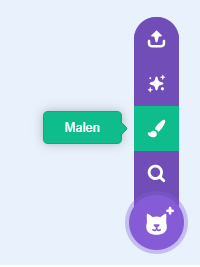
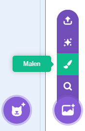
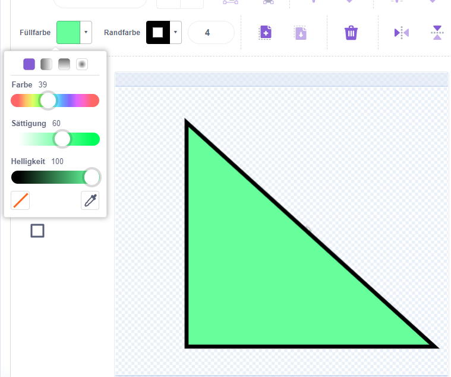
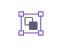

Du kannst Hintergründe und Kostüme für Figuren erstellen, indem du im Malen-Fenster Formen verwendest.

Gehe zum Menü **Figur wählen** oder **Hintergrund wählen** und wähle die Option **Malen**:

{:style="float: left"}

{:style="float: left"}

Wähle aus, welche(s) Werkzeug(e) du zum Erstellen der gewünschten Form(en) verwenden möchtest:

+ **Kreis**: Klicke auf das Werkzeug **Kreis**, um einen Kreis zu zeichnen. Halte die <kbd>Umschalttaste</kbd> auf deiner Tastatur gedrückt, um einen perfekten Kreis zu zeichnen.

+ **Rechteck**: Klicke auf das Werkzeug **Rechteck**, um ein Rechteck zu zeichnen. Halte die <kbd>Umschalttaste</kbd> gedrückt, um ein Quadrat zu zeichnen.

+ **Dreieck**: Verwende das Werkzeug **Rechteck**, um ein Rechteck oder ein Quadrat zu zeichnen. Klicke auf das Werkzeug **Verformen** und wähle die Ecke aus, die du entfernen möchtest. Klicke auf das Werkzeug **Löschen**, um die Form in ein Dreieck umzuwandeln.

{:style="width: 150px"}

{:style="width: 150px"}

Du kannst das Werkzeug **Fülleimer** verwenden, um die Farbe einer Form zu ändern:

{:style="width: 350px"}

Möglicherweise musst du die Werkzeuge **nach vorne** und **nach hinten** verwenden, um deine Formen nach vorne oder hinten zu verschieben, damit sie in deinem Bild richtig positioniert sind:

Du kannst alle Formen auswählen und **Gruppieren**, sodass du sie als eine Form anpassen oder verschieben kannst:

{:style="width: 350px"}

Hier ist ein Beispiel für eine Figur, die mit den Werkzeugen **Kreis** und **Rechteck** erstellt wurde:

  <iframe allowtransparency="true" width="485" height="402" src="" frameborder="0"></iframe>

Denke daran, den Kostümen und Hintergründen, die du im Malen-Fenster erstellst, einen Namen zu geben.
