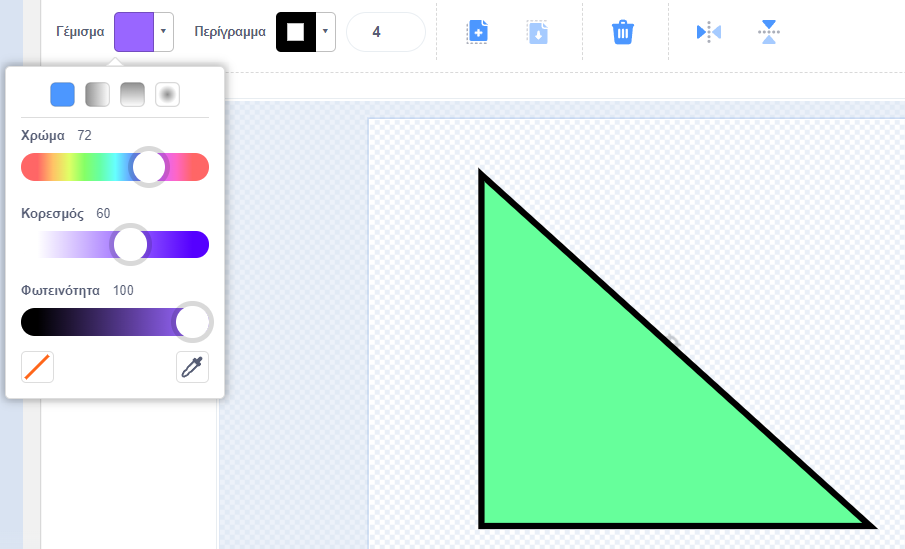

Μπορείτε να δημιουργήσετε σκηνικά και κοστούμια για sprites στον επεξεργαστή Paint, χρησιμοποιώντας μόνο σχήματα.

Μεταβείτε στο **Επιλέξτε ένα Αντικείμενο** ή **Επιλέξτε Υπόβαθρο** και επιλέξτε την επιλογή **Ζωγραφική**:

{:style="float: left"}

{:style="float: left"}

Επιλέξτε ποια εργαλεία θα χρησιμοποιήσετε για να κάνετε το σχήμα(τα) που θέλετε:

+ **Κύκλος**: Κάντε κλικ στο **Κύκλος** για να σχεδιάσετε έναν κύκλο. Πατήστε παρατεταμένα το πλήκτρο <kbd>Shift</kbd> στο πληκτρολόγιό σας για να σχεδιάσετε έναν τέλειο κύκλο.

+ **Ορθογώνιο**: Κάντε κλικ στο **Ορθογώνιο** για να σχεδιάσετε ένα ορθογώνιο. Πατήστε παρατεταμένα το πλήκτρο <kbd>Shift</kbd> για να σχεδιάσετε ένα τετράγωνο.

+ **Τρίγωνο**: Χρησιμοποιήστε το **Ορθογώνιο** για να σχεδιάσετε ένα ορθογώνιο ή ένα τετράγωνο. Κάντε κλικ στο **Αναδιαμόρφωση** και επιλέξτε τη γωνία που θέλετε να καταργήσετε. Κάντε κλικ στο **Διαγραφή** για να μετατρέψετε το σχήμα σας σε τρίγωνο.

{:style="width: 150px"}

{:style="width: 150px"}

Μπορείτε να χρησιμοποιήσετε το **Γέμισμα** για να αλλάξετε το χρώμα ενός σχήματος:

{:style="width: 350px"}

Ίσως χρειαστεί να χρησιμοποιήσετε τα **προς τα εμπρός** και **προς τα πίσω** για να μετακινήσετε τα σχήματά σας προς τα εμπρός ή προς τα πίσω, ώστε να τοποθετηθούν σωστά μέσα στην εικόνα σας:

Μπορείτε να επιλέξετε όλα τα σχήματα και **Ομαδοποίηση** ώστε να μπορείτε να τα προσαρμόσετε ή να τα μετακινήσετε ως ένα σχήμα:

{:style="width: 350px"}

Ακολουθεί ένα παράδειγμα sprite που δημιουργήθηκε με τα εργαλεία **Κύκλος** και **Ορθογώνιο**:

**Γουρούνι**: [Δείτε μέσα](https://scratch.mit.edu/projects/495903163/editor){: target = "_ blank"}

  <iframe allowtransparency="true" width="485" height="402" src="https://scratch.mit.edu/projects/embed/495903163/?autostart=false" frameborder="0"></iframe>

Θυμηθείτε να ονομάσετε τα κοστούμια και τα σκηνικά που δημιουργείτε στον επεξεργαστή Paint.
