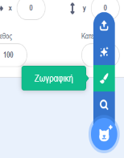

Μπορείς να δημιουργήσεις υπόβαθρα και ενδυμασίες για αντικείμενα στον επεξεργαστή Ζωγραφικής, χρησιμοποιώντας μόνο σχήματα.

Πήγαινε στο μενού **Επιλέξτε ένα Αντικείμενο** ή **Επιλέξτε Υπόβαθρο** και διάλεξε την επιλογή **Ζωγραφική**:

{:style="float: left"}

{:style="float: left"}

Επίλεξε ποια εργαλεία θα χρησιμοποιήσεις για να κάνεις τα σχήματα που θέλεις:

+ **Κύκλος**: Κάνε κλικ στο εργαλείο **Κύκλος** για να σχεδιάσεις έναν κύκλο. Πάτα παρατεταμένα το πλήκτρο <kbd>Shift</kbd> στο πληκτρολόγιό σου για να σχεδιάσεις έναν τέλειο κύκλο.

+ **Ορθογώνιο**: Κάνε κλικ στο εργαλείο **Ορθογώνιο** για να σχεδιάσεις ένα ορθογώνιο. Πάτα παρατεταμένα το πλήκτρο <kbd>Shift</kbd> για να σχεδιάσεις ένα τετράγωνο.

+ **Τρίγωνο**: Χρησιμοποίησε το εργαλείο **Ορθογώνιο** για να σχεδιάσεις ένα ορθογώνιο ή ένα τετράγωνο. Κάνε κλικ στο εργαλείο **Αλλαγή σχήματος** και επίλεξε τη γωνία που θέλεις να καταργήσεις. Κάνε κλικ στο εργαλείο **Διαγραφή** για να μετατρέψεις το σχήμα σου σε τρίγωνο.

{:style="width: 150px"}

{:style="width: 150px"}

Μπορείς να χρησιμοποιήσεις το εργαλείο **Γέμισμα** για να αλλάξεις το χρώμα ενός σχήματος:

{:style="width: 350px"}

Ίσως χρειαστεί να χρησιμοποιήσεις τα εργαλεία **Προς τα εμπρός** και **Προς τα πίσω** για να μετακινήσεις τα σχήματά σου προς τα εμπρός ή προς τα πίσω, ώστε να τοποθετηθούν σωστά μέσα στην εικόνα σου:

Μπορείς να επιλέξεις όλα τα σχήματα και με το εργαλείο **Ομαδοποίηση** να τα προσαρμόσεις ή να τα μετακινήσεις ως ένα σχήμα:

{:style="width: 350px"}

Ακολουθεί ένα παράδειγμα αντικειμένου που δημιουργήθηκε με τα εργαλεία **Κύκλος** και **Ορθογώνιο**:

**Γουρούνι**: [Δες μέσα](https://scratch.mit.edu/projects/495903163/editor){: target = "_ blank"}

  <iframe allowtransparency="true" width="485" height="402" src="https://scratch.mit.edu/projects/embed/495903163/?autostart=false" frameborder="0"></iframe>

Θυμήσου να ονομάσεις τις ενδυμασίες και τα υπόβαθρα που δημιούργησες στον επεξεργαστή Ζωγραφική.
