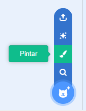
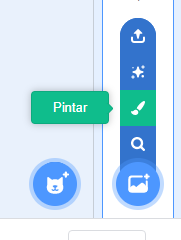
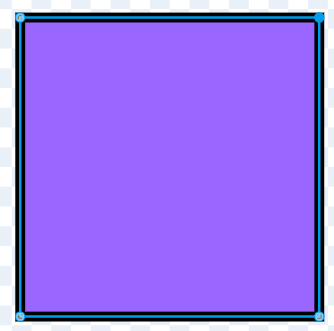
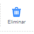
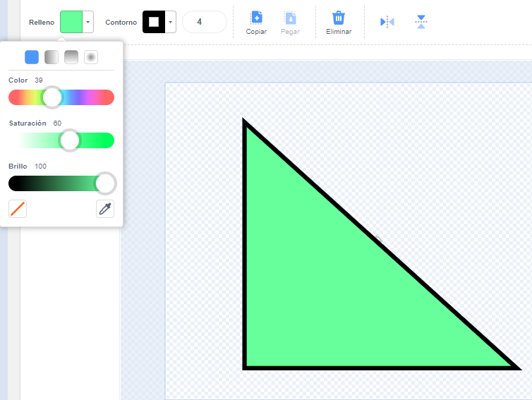
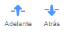
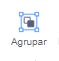

Puedes crear fondos y disfraces para objetos en el editor de Dibujo, usando solo formas.

Ve al menú **Elegir un objeto** o **Elige un fondo** y elige la opción **Pintar**:

{:style="float: left"}

{:style="float: left"}

Selecciona qué herramienta(s) usar para hacer la(s) forma(s) que deseas:

+ **Círculo**: Haz clic en la herramienta **Círculo** para dibujar un círculo. Mantén presionada la tecla <kbd>Mayúscula</kbd> en tu teclado para dibujar un círculo perfecto.

+ **Rectángulo**: Haz clic en la herramienta **Rectángulo** para dibujar un rectángulo. Mantén presionada la tecla <kbd>Mayúscula</kbd> para dibujar un cuadrado.

+ **Triángulo**: Usa la herramienta **Rectángulo** para dibujar un rectángulo o un cuadrado. Haz clic en la herramienta **Cambiar la forma** y selecciona la esquina que deseas eliminar. Haz clic en la herramienta **Eliminar** para convertir tu forma en un triángulo.

{:style="width: 150px"}

{:style="width: 150px"}

Puedes utilizar la herramienta **Relleno** para cambiar el color de una forma:

{:style="width: 350px"}

Es posible que debas usar las herramientas **Adelante** y **Atrás** para mover tus formas hacia adelante o hacia atrás para que estén colocadas correctamente dentro de tu imagen:

Se pueden seleccionar todas las formas y **Agruparlas** entre sí de modo que se puedan ajustar o moverlas como una sola forma:

{:style="width: 350px"}

A continuación se muestra un ejemplo de un objeto creado con las herramientas **Círculo** y **Rectángulo**:

**Cerdo**: [Ver dentro](https://scratch.mit.edu/projects/495903163/editor){:target="_blank"}

  <iframe allowtransparency="true" width="485" height="402" src="https://scratch.mit.edu/projects/embed/495903163/?autostart=false" frameborder="0"></iframe>

Recuerda nombrar los disfraces y los fondos que creas en el editor de dibujo.

