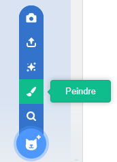
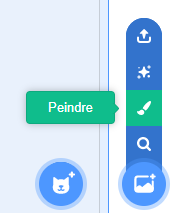
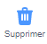
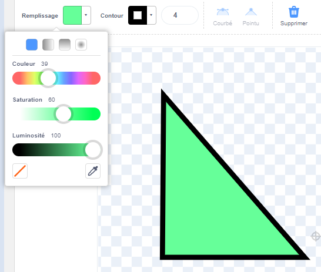
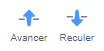
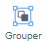

Tu peux créer des arrière-plans et des costumes pour les sprites dans l'éditeur de peinture, en utilisant uniquement des formes.

Va dans le menu **Choisir un Sprite** ou **Choisir un arrière-plan** et choisis l'option **Peindre** :

{:style="float: left"}

{:style="float: left"}

Sélectionne les outils que tu utiliseras pour la ou les forme(s) souhaitée(s) :

+ **Cercle** : Clique sur l'outil **Cercle** pour dessiner un cercle. Appuie sur la touche <kbd>Maj</kbd> de ton clavier et maintiens-la enfoncée pour dessiner un cercle parfait.

+ **Rectangle** : Clique sur l'outil **Rectangle** pour dessiner un rectangle. Maintiens la touche <kbd>Maj</kbd> pour dessiner un carré.

+ **Triangle** : Utilise l'outil **Rectangle** pour dessiner un rectangle ou un carré. Clique sur l'outil **Redessiner** et sélectionne le coin que tu souhaites supprimer. Clique sur l'outil **Supprimer** pour transformer ta forme en triangle.

{:style="width: 150px"}

{:style="width: 150px"}

Tu peux utiliser l'outil **Remplissage** pour changer la couleur d'une forme :

{:style="width: 350px"}

Tu devras peut-être utiliser les outils **Avancer** et **Reculer** pour déplacer tes formes vers l'avant ou vers l'arrière afin qu'elles soient correctement positionnées dans ton image :

Tu peux sélectionner toutes les formes et les **Grouper** ensemble afin de pouvoir les ajuster ou les déplacer en une seule forme :

{:style="width: 350px"}

Voici un exemple de sprite créé avec les outils **Cercle** et **Rectangle** :

**Cochon** : [Voir à l'intérieur](https://scratch.mit.edu/projects/495903163/editor){:target="_ blank"}

  <iframe allowtransparency="true" width="485" height="402" src="https://scratch.mit.edu/projects/embed/495903163/?autostart=false" frameborder="0"></iframe>

N'oublie pas de nommer les costumes et les arrière-plans que tu crées dans l'éditeur de peinture.
