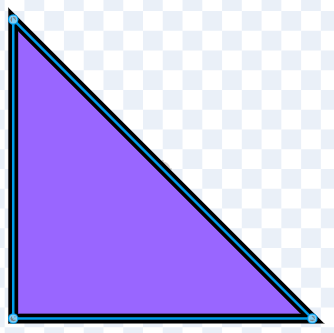

You can create backdrops and costumes for sprites in the Paint editor, using just shapes.

Go to the **Choose a Sprite** or **Choose a Backdrop** menu and choose the **Paint** option:

{:style="float: left"}

{:style="float: left"}

Select which tool(s) to use to make the shape(s) that you want:

+ **Circle**: Click on the **Circle** tool to draw a circle. Press and hold the <kbd>Shift</kbd> key on your keyboard to draw a perfect circle.

+ **आयत**: आयत बनाने के लिए **आयत** टूल पर क्लिक करें। एक आयत बनाने के लिए <kbd>Shift</kbd> कुंजी को दबाकर रखें।

+ **Triangle**: Use the **Rectangle** tool to draw a rectangle or a square. **रीशेप** टूल पर क्लिक करें और उस कोने को चुनें जिसे आप हटाना चाहते हैं। Click on the **Delete** tool to turn your shape into a triangle.

{:style="width: 150px"}

{:style="width: 150px"}

किसी आकृति का रंग बदलने के लिए आप **भरण** टूल का उपयोग कर सकते हैं:

{:style="width: 350px"}

You may need to use the **Forward** and **Backward** tools to move your shapes forward or backward so that they are positioned correctly within your image:

You can select all the shapes and **Group** them together so that you can adjust them or move them as one shape:

{:style="width: 350px"}

Here is an example of a sprite created with the **Circle** and **Rectangle** tools:

**सुअर**: [अंदर देखें](https://scratch.mit.edu/projects/495903163/editor) {:target="_blank"}

  <iframe allowtransparency="true" width="485" height="402" src="https://scratch.mit.edu/projects/embed/495903163/?autostart=false" frameborder="0"></iframe>

Remember to name the costumes and backdrops that you create in the Paint editor.
