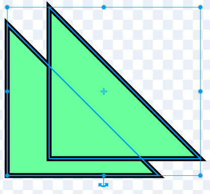

आप केवल आकृतियों का उपयोग करके, पेंट संपादक में स्प्राइट्स के लिए बैकड्रॉप और पोशाक बना सकते हैं।

**Choose a Sprite** (स्प्राइट चुनें) या **Choose a Backdrop** (बैकड्रॉप चुनें) मेन्यू पर जाएं और **Paint** (पेंट) विकल्प चुनें:

{:style="float: left"}

{:style="float: left"}

इच्छित आकार बनाने के लिए उपयोग किए जाने वाले टूल का चयन करें:

+ **चक्र**: वृत्त बनाने के लिए **चक्र** टूल पर क्लिक करें। एक पूर्ण चक्र बनाने के लिए अपने कीबोर्ड पर <kbd>Shift</kbd> कुंजी को दबाकर रखें।

+ **आयत**: आयत बनाने के लिए **आयत** टूल पर क्लिक करें। एक आयत बनाने के लिए <kbd>Shift</kbd> कुंजी को दबाकर रखें।

+ **त्रिभुज**: आयत या वर्ग बनाने के लिए **आयत** टूल का उपयोग करें। **रीशेप** टूल पर क्लिक करें और उस कोने को चुनें जिसे आप हटाना चाहते हैं। अपने आकार को त्रिभुज में बदलने के लिए **Delete** (डिलीट) टूल पर क्लिक करें।

{:style="width: 150px"}

{:style="width: 150px"}

किसी आकृति का रंग बदलने के लिए आप **भरण** टूल का उपयोग कर सकते हैं:

{:style="width: 350px"}

आपको अपनी आकृतियों को आगे या पीछे ले जाने के लिए **Froward** (फॉरवर्ड) और **Backward** (बैकवर्ड) टूल का उपयोग करने की आवश्यकता हो सकती है ताकि वे आपकी छवि में सही ढंग से स्थित हो सकें:

आप सभी आकृतियों का चयन करके **ग्रुप** (Group) कर सकते हैं ताकि आप उन्हें समायोजित कर सकें या उन्हें एक आकार के रूप में स्थानांतरित कर सकें:

{:style="width: 350px"}

यहां **चक्र** और **आयत** टूल के साथ बनाए गए स्प्राइट का उदाहरण दिया गया है:

**सुअर**: [अंदर देखें](https://scratch.mit.edu/projects/495903163/editor){:target="_blank"}

  <iframe allowtransparency="true" width="485" height="402" src="https://scratch.mit.edu/projects/embed/495903163/?autostart=false" frameborder="0"></iframe>

पेंट संपादक में आपके द्वारा बनाई जाने वाली पोशाकों और बैकड्रॉप को नाम देना याद रखें।
