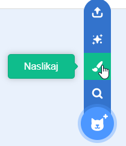
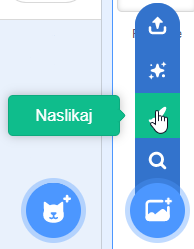
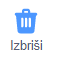
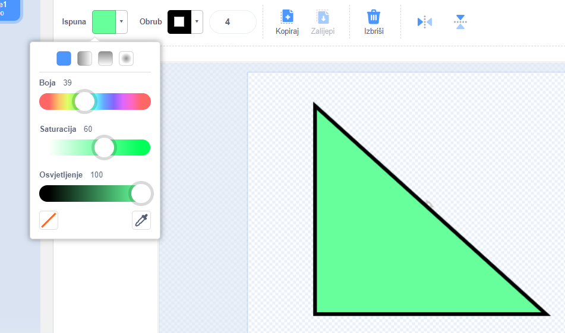
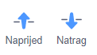
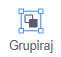

Možeš kreirati pozadine i kostime za likove u Paint uređivaču koristeći samo oblike.

Idi na izbornik **Odaberi lik** ili **Odaberi pozadinu** i odaberi opciju **Naslikaj**:

{:style="float: left"}

{:style="float: left"}

Odaberi alat(e) koje ćeš koristiti da izradiš svoj oblik(e):

+ **Krug**: Klikni na alat **Kružnica** da nacrtaš krug. Pritisni i drži tipku <kbd>Shift</kbd> na tipkovnici za crtanje savršenog kruga.

+ **Pravokutnik**: Klikni na alat **Pravokutnik** da nacrtaš pravokutnik. Pritisni i drži tipku <kbd>Shift</kbd> za crtanje kvadrata.

+ **Trokut**: Koristi alat **Pravokutnik** da nacrtaš pravokutnik ili kvadrat. Klikni na alat **Preoblikuj** i odaberi kut koji želiš ukloniti. Klikni na alat **Izbriši** da svoj oblik pretvorš u trokut.

{:style="width: 150px"}

{:style="width: 150px"}

Možeš koristiti alat **Ispuna** da promijeniš boju oblika:

{:style="width: 350px"}

Možda ćeš morati upotrijebiti alate **Naprijed** i **Natrag** da pomakneš svoje oblike naprijed ili natrag tako da budu ispravno postavljeni unutar tvoje slike:

Možeš odabrati sve oblike i **grupirati** ih zajedno tako da ih možeš prilagoditi ili premjestiti kao jedan oblik:

{:style="width: 350px"}

Evo primjera lika stvorenog alatima **Kružnica** i **Pravokutnik**:

  <iframe allowtransparency="true" width="485" height="402" src="" frameborder="0"></iframe>

Ne zaboravi imenovati kostime i pozadine koje izradiš u Paint uređivaču.
