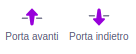

Puoi creare sfondi e costumi per gli sprite nell'editor Paint, usando solo le forme.

Vai al menu **Scegli uno Sprite** o **Scegli uno Sfondo** e scegli l'opzione **Disegna un nuovo Sprite/Sfondo**:

{:style="float: left"}

{:style="float: left"}

Seleziona quali strumenti utilizzare per creare le forme desiderate:

+ **Cerchio**: Cliccare sullo strumento **Cerchio** per disegnare un cerchio. Tieni premuto il tasto <kbd>Shift</kbd> sulla tastiera per disegnare un cerchio perfetto.

+ **Rettangolo**: Clicca sullo strumento **Rettangolo** per disegnare un rettangolo. Tieni premuto il tasto <kbd>Shift</kbd> per disegnare un quadrato.

+ **Triangolo**: Usa lo strumento **Rettangolo** per disegnare un rettangolo o un quadrato. Clicca sullo strumento **Modifica Contorno** e seleziona il vertice che vuoi rimuovere. Clicca sullo strumento **Cancella** per trasformare la tua forma in un triangolo.

{:style="width: 150px"}

{:style="width: 150px"}

Puoi usare lo strumento **Riempimento** per cambiare il colore di una forma:

{:style="width: 350px"}

Potresti dover usare gli strumenti **Porta avanti** e **Porta indietro** per mettere le forme in primo o secondo piano, in modo che siano posizionate correttamente all'interno dell'immagine:

Puoi selezionare tutte le forme e usare lo strumento **Raggrupa** per raggrupparle insieme, così le potrai cambiare o muovere come se fossero un'unica forma:

{:style="width: 350px"}

Ecco un esempio di uno sprite creato con gli strumenti **Cerchio** e **Rettangolo**:

**Pig**: [Guarda dentro](https://scratch.mit.edu/projects/495903163/editor){:target="_blank"}

  <iframe allowtransparency="true" width="485" height="402" src="https://scratch.mit.edu/projects/embed/495903163/?autostart=false" frameborder="0"></iframe>

Ricorda di dare un nome ai costumi e agli sfondi che crei nell'editor Paint.
