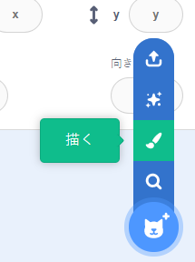
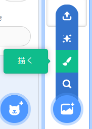

ペイントエディターの図形だけを使って背景やスプライトのコスチュームを作成できます。

**スプライトを選ぶ**または**背景を選ぶ** メニューから**描く**オプションを選択します。

{:style="float: left"}

{:style="float: left"}

作りたい図形を作るのに使うツールを選択します。

+ **円**: **円**ツールをクリックして円を描きます。 キーボードの<kbd>Shift</kbd>キーを押したままにすると真円を描くことができます。

+ **四角形**: **四角形**ツールをクリックして四角形を描画します。 <kbd>Shift</kbd>キーを押したままにすると正方形を描くことができます。

+ **三角形**: **四角形**ツールをクリックして長方形や正方形を描画します。 **形を変える**ツールをクリックして削除する角を選択します。 **削除**ツールをクリックして図形を三角形に変えます。

{:style="width: 150px"}

{:style="width: 150px"}

**塗りつぶし**ツールを使用して図形の色を変更できます。

{:style="width: 350px"}

画像内で正しく配置されるように、**手前に出す**および**奥に下げる**ツールを使用して図形を前後に移動できます。

全ての図形を選択し**グループ化**を使って1つにまとめると、1つの図形であるかのように調整したり動かすことができます。

{:style="width: 350px"}

これは**円**および**四角形**ツールで作成されたスプライトの一例です。

**豚**: [中を見る](https://scratch.mit.edu/projects/495903163/editor){:target="_blank"}

  <iframe allowtransparency="true" width="485" height="402" src="https://scratch.mit.edu/projects/embed/495903163/?autostart=false" frameborder="0"></iframe>

ペイントエディターで作成するコスチュームや背景に名前を付けることを忘れないでください。

