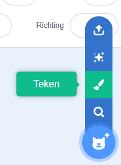
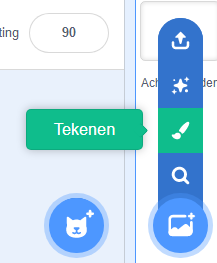
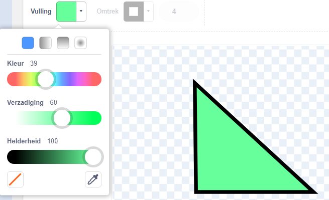
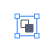

Je kunt achtergronden en uiterlijken voor sprites maken in de Teken-editor door enkel vormen te gebruiken.

Ga naar het **Kies een sprite** of **Kies een achtergrond** menu en kies de **Tekenen** optie:

{:style="float: left"}

{:style="float: left"}

Bepaal welk(e) gereedschap(pen) je wilt gebruiken voor de vorm(en) die je wilt:

+ **Cirkel**: Klik op het **Cirkel** gereedschap om een cirkel te tekenen. Houdt de <kbd>Shift</kbd> toets op je toetsenbord ingedrukt om een perfecte cirkel te tekenen.

+ **Rechthoek**: Klik op het **Rechthoek** gereedschap om een rechthoek te tekenen. Houd <kbd>Shift</kbd> ingedrukt om een vierkant te tekenen.

+ **Driehoek**: Gebruik het **Rechthoek** gereedschap om een rechthoek of vierkant te tekenen. Klik op het **Opnieuw vormen** gereedschap en kies de hoek die je wilt verwijderen. Klik op het **Verwijder** pictogram om je vorm in een driehoek te veranderen.

{:style="width: 150px"}

{:style="width: 150px"}

Je kunt het **Vulling** gereedschap gebruiken om de kleur van een vorm te veranderen:

{:style="width: 350px"}

Het kan zijn dat je de **Naar voren** en **Naar achteren** gereedschappen nodig hebt om je vormen naar voren of achteren te verplaatsen, zodat ze goed binnen je afbeelding passen:

Je kunt alle vormen selecteren en ze samen **Groeperen** zodat je ze als één geheel kunt aanpassen of verplaatsen:

{:style="width: 350px"}

Hier een voorbeeld van een sprite gemaakt met de **Cirkel** en **Rechthoek** gereedschappen:

  <iframe allowtransparency="true" width="485" height="402" src="" frameborder="0"></iframe>

Vergeet niet om de uiterlijken en achtergronden die je maakt in de Teken editor een naam te geven.
