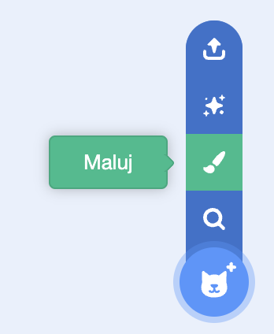
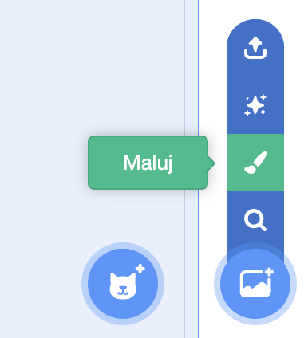
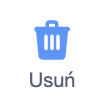
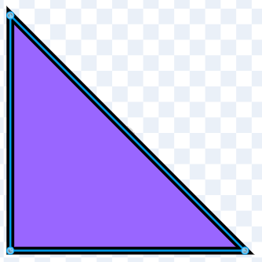
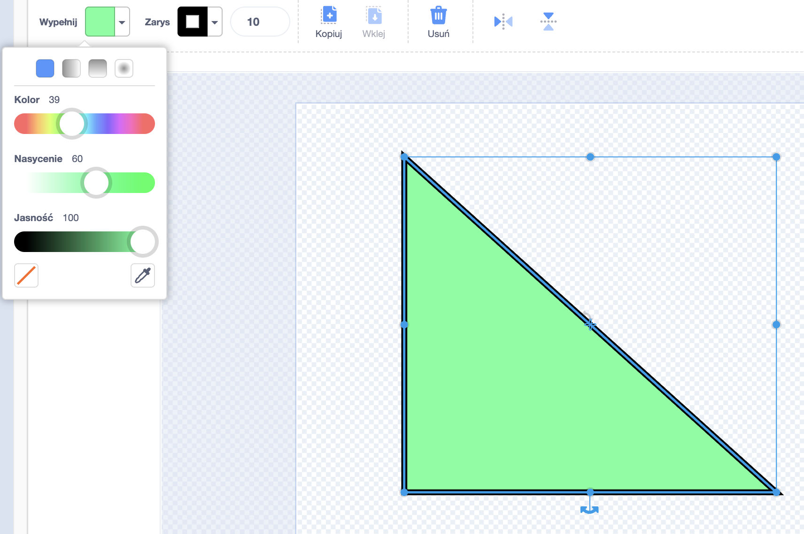
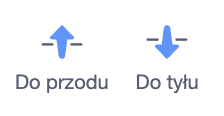
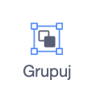

Możesz tworzyć tła i kostiumy dla duszków w edytorze Maluj, używając tylko kształtów.

Przejdź do menu **Wybierz duszka** lub **Wybierz tło** i wybierz opcję **Maluj**:

Wybierz narzędzia, których chcesz użyć do stworzenia żądanych kształtów:

+ **Okrąg**: Kliknij narzędzie **Okrąg**, aby narysować okrąg. Naciśnij i przytrzymaj klawisz <kbd>Shift</kbd> na klawiaturze, aby narysować idealny okrąg.

+ **Prostokąt**: Kliknij narzędzie **Prostokąt**, aby narysować prostokąt. Naciśnij i przytrzymaj klawisz <kbd>Shift</kbd>, aby narysować kwadrat.

+ **Trójkąt**: Użyj narzędzia **Prostokąt**, aby narysować prostokąt lub kwadrat. Kliknij narzędzie **Przekształć** i wybierz narożnik, który chcesz usunąć. Kliknij narzędzie **Usuń**, aby zmienić swój kształt w trójkąt.

{:style="width: 150px"}

{:style="width: 150px"}

Możesz użyć narzędzia **Wypełnij**, aby zmienić kolor kształtu:

{:style="width: 350px"}

Może być konieczne użycie narzędzi **Do przodu** i **Do tyłu**, aby przesunąć kształty do przodu lub do tyłu, tak aby były prawidłowo umieszczone na obrazie:

Możesz zaznaczyć wszystkie kształty i wybrać **Grupuj**, dzięki czemu można dostosować je lub przenieść jako jeden kształt:

{:style="width: 350px"}

Oto przykład duszka utworzonego za pomocą narzędzi **Okrąg** i **Prostokąt**:

**Świnka**: [Zobacz wnętrze](https://scratch.mit.edu/projects/495903163/editor){:target="_blank"}

  <iframe allowtransparency="true" width="485" height="402" src="https://scratch.mit.edu/projects/embed/495903163/?autostart=false" frameborder="0"></iframe>

Pamiętaj, aby nazwać kostiumy i tła, które tworzysz w edytorze Maluj.
