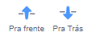

Você pode criar cenários e fantasiar atores no editor de pintura, usando apenas formas.

Vá para o menu **Escolha um ator** ou **Escolha um cenário** e selecione a opção **Pintar**:

{:style="float: left"}

{:style="float: left"}

Selecione qual(is) ferramenta(s) utilizar para fazer a(s) forma(s) que você deseja:

+ **Círculo**: Clique na ferramenta **Círculo** para desenhar um círculo. Pressione e segure a tecla <kbd>Shift</kbd> no seu teclado para desenhar um círculo perfeito.

+ **Retângulo**: Clique na ferramenta **Retângulo** para desenhar um retângulo. Pressione e segure a tecla <kbd>Shift</kbd> para desenhar um quadrado.

+ **Triângulo**: Use a ferramenta **Retângulo** para desenhar um retângulo ou um quadrado. Clique na ferramenta **Remodelar** e selecione o canto que você deseja remover. Clique na ferramenta **Deletar** para transformar sua forma em um triângulo.

{:style="width: 150px"}

{:style="width: 150px"}

Você pode usar a ferramenta **Preencher** para mudar a cor da forma:

{:style="width: 350px"}

Você pode usar as ferramentas **Para frente** e **Para trás** para mover suas formas para frente ou para trás de forma que elas sejam posicionadas corretamente dentro da sua imagem:

Você pode selecionar todas as formas e **Agrupar** de modo que elas possam ser ajustadas e movidas juntas:

{:style="width: 350px"}

Aqui temos um exemplo de um ator criado com as ferramentas **Círculo** e **Retângulo**:

**Porco**: [Veja um exemplo](https://scratch.mit.edu/projects/495903163/editor){:target="_blank"}

  <iframe allowtransparency="true" width="485" height="402" src="https://scratch.mit.edu/projects/embed/495903163/?autostart=false" frameborder="0"></iframe>

Lembre-se de nomear as fantasias e os cenários que você criou no editor de Pintar.
