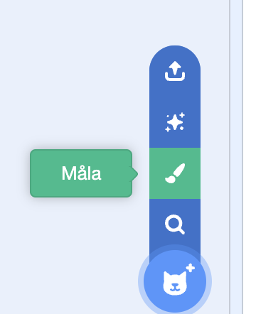

Du kan skapa bakgrunder och klädslar till sprajter i målarredigeraren med bara former.

Gå till **"Välj en Sprite"**-menyn eller **"Välj en bakgrund"**-menyn och välj alternativet **Måla**:

{:style="float: left"}

{:style="float: left"}

Välj vilka verktyg som ska användas för att skapa formerna du vill ha:

+ **Cirkel**: Klicka på **Cirkel**verktyget för att rita en cirkel. Tryck och håll ned <kbd>Shift</kbd>-tangenten på ditt tangentbord för att rita en perfekt cirkel.

+ **Rektangel**: Klicka på **Rektangel**verktyget för att rita en rektangel. Tryck och håll ned <kbd>Shift</kbd>-tangenten för att rita en kvadrat.

+ **Triangel**: Använd **rektangel**-verktyget för att rita en rektangel eller en kvadrat. Klicka på **Omforma**verktyget och välj det hörn som du vill ta bort. Klicka på **Ta bort** för att förvandla din form till en triangel.

{:style="width: 150px"}

{:style="width: 150px"}

Du kan använda **Fyll**verktyget för att ändra färgen på en form:

{:style="width: 350px"}

Du kan behöva använda **Framåt**- och **Bakåt**verktygen för att flytta dina former framåt eller bakåt så att de placeras rätt i din bild:

Du kan välja alla formerna och **Gruppera** dem tillsammans så att du kan justera dem och flytta dem som en form:

{:style="width: 350px"}

Här är ett exempel på en sprajt som har skapats med **Cirkel**- och **Rektangel**verktygen:

  <iframe allowtransparency="true" width="485" height="402" src="" frameborder="0"></iframe>

Kom ihåg att namnge klädslarna och bakgrunderna som du skapar i målarredigeraren.
