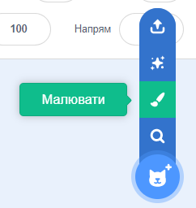
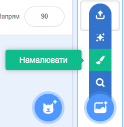
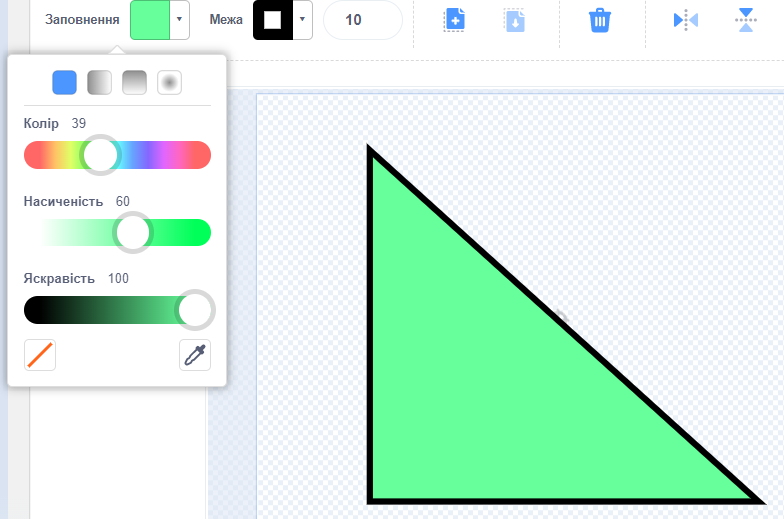
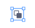

Створювати тло і образи для спрайтів в Редакторі малювання можна лише з використанням фігур.

Перейди до меню **Обрати спрайт** або до меню **Обрати тло** та вибери опцію **Малювати**:

{:style="float: left"}

{:style="float: left"}

Вибери інструмент(-и), який(-і) необхідно використати для створення потрібної тобі форми:

+ **Коло**: клацни на інструмент **Коло**, щоб намалювати коло. Натисни і утримуй клавішу <kbd>Shift</kbd> на своїй клавіатурі, щоб створити ідеальне коло.

+ **Прямокутник**: клацни на інструмент **Прямокутник**, щоб створити прямокутник. Натисни і утримуй клавішу <kbd>Shift</kbd>, щоб намалювати квадрат.

+ **Трикутник**: використовуй інструмент **Прямокутник**, щоб намалювати прямокутник або квадрат. Клацни на інструмент **Змінити форму** і вибери кут, який потрібно видалити. Клацни на інструмент **Вилучити**, щоб перетворити свою фігуру в трикутник.

{:style="width: 150px"}

{:style="width: 150px"}

Ти можеш використовувати інструмент **Заливка**, щоб змінювати колір фігури:

{:style="width: 350px"}

Також тобі може знадобитися інструмент **Вперед** та інструмент **Назад**, щоб переміщати фігури вперед або назад так, щоб вони правильно розташовувалися на зображенні:

Ти можеш вибрати всі фігури та **Групувати** їх разом, щоб можна було коригувати їх або переміщати як одну фігуру:

{:style="width: 350px"}

Ось приклад спрайта, створеного за допомогою інструментів **Коло** та **Прямокутник**:

**Свиня**: [Переглянути код](https://scratch.mit.edu/projects/495903163/editor){:target="_blank"}

  <iframe allowtransparency="true" width="485" height="402" src="https://scratch.mit.edu/projects/embed/495903163/?autostart=false" frameborder="0"></iframe>

Пам'ятай, що образам та тлам, які ти створюєш у Редакторі малювання, потрібно давати назву.
