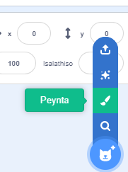
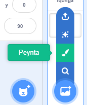

Unako ukuzenzela imifanekiso yangasemva ne khostum zesprite kuyilo lwepayinti, usebenzisa iimilo.

Yiya kwimenyu **Khetha i-Sprite** okanye **Khetha Umfanekiso Wangaemva** kwaye ukhethe i-**Peyinti**:

{:style="float: left"}

{:style="float: left"}

Khetha ukuba sesiphi (izi)isixhobo oza kusisebenzisa ukwenza (i)imilo oyifunayo:

+ **Isangqa**: Cofa kwisixhobo **Isangqa** ukuze uzobe isangqa. Cinezela kwaye ubambe iqhosha <kbd>Shift</kbd> kwisizhaxhazi ukuze uzobe isangqa esigqibeleleyo.

+ **Uxande**: Cofa kwisixhobo **Uxande** ukuze uzobe uxande. Cinezela kwaye ubambe iqhosha <kbd>Shift</kbd> kwisizhaxhazi ukuze uzobe isikwere.

+ **Unxantathu**: Cofa kwisixhobo **Uxande** ukuze uzobe uxande okanye iskwere. Cofa kwisixhobo soku-**Milisa ngokutsha** cofa, ukhethe ikona ofuna ukuyisusa. Cofa kwisixhobo **Cima** kusuke ukona le ubuyikhethile, kuguqulele isimilo sakho sibe ngunxantathu.

{:style="width: 150px"}

{:style="width: 150px"}

Ungasebenzisa isixhobo **Gcwalisa** ukutshintsha umbala:

![Indawo yokukhetha umbala [Gcwalisa] kunye nombala omtsha.](images/changed-colour.png){:style="width: 350px"}

Kusenokufuneka usebenzise izixhobo u-**Phambili** kunye no- **Ngasemva** ukuze ususe iimizobo zakho phambili okanye ngasemva ukuze uzibekwe kakuhle kumfanekiso wakho:

Uyakwazi ukukhetha yonke iimilo kwaye uyi**Dibanise** yonke ukuze uyilungise okanye uyihambise xeshanye ngokungathi ngummilo omnye:

{:style="width: 350px"}

Nanku umzekelo weSprite owenziwe ngezixhobo i**Sangqa** kunye no **Uxande**:

**Ihagu**: [Bona ngaphakathi](https://scratch.mit.edu/projects/495903163/editor){:target="_blank"}

  <iframe allowtransparency="true" width="485" height="402" src="https://scratch.mit.edu/projects/embed/495903163/?autostart=false" frameborder="0"></iframe>

Khumbula ukuthiya iikhostyum nemifanekiso yangasemva othe wazenza ngoYilo lwePayinti.
